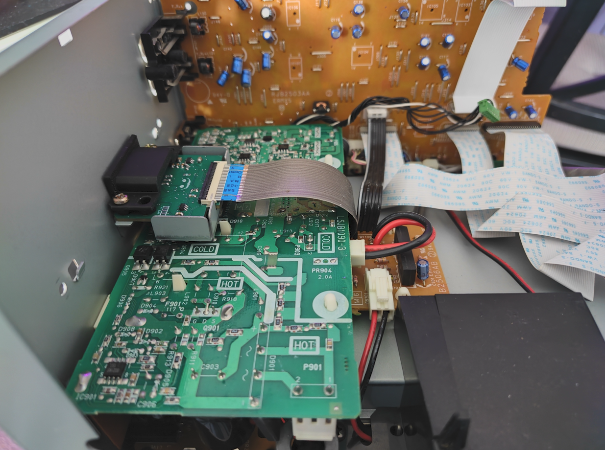
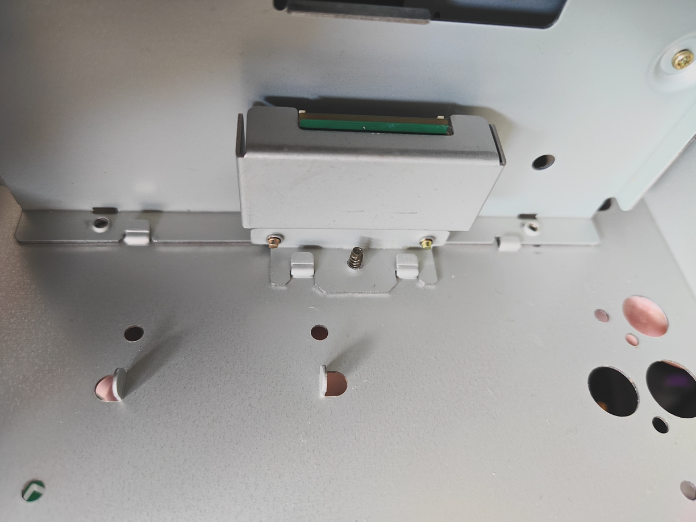

# PanasonicQ_HDMI
This repository contains the full PCB source (made in altium) and gerbers for a drop-in HDMI replacement for the Panasonic Q Gamecube Digital port.
The design is based on Steven Taffs Shuriken Video schematic drawing and as such has inherited the name in the schematic, officially named Shuriken Video Panasonic Q.

This is the ONLY true drop-in replacement for the digital port that doesn't require any additional mounting hardware, 
it will mount directly on the original metal bracket and plug into the original flat flex cable.

The 3D print works as a test-fit but will not fit without modification in the complete assembly. I'm very new to 3D printing and designing parts so I advise not printing it yet, or making your own modifications to it as it's not what I'd consider 'final' just yet!

Since the project revolves around being primarily aimed toward DIY, I made sure each of the components can be hand-soldered by an average DIY-er. 
No BGA parts ;)

Here's some example images of the finished device

## PCB Production

Testing was done using JLCPCB and as such the Gerber files are provided to their output specifications.

The design is verified to work as a 4-layer PCB and 5 can be bought at their special offer for $2.

## Bill of Materials

Are located in the BOM file in the /out folder

In case they can't be sourced, confirmed suitable replacements for the M25P40 that are pin-compatible are:

* AT25DF041B
* W25X40CLSNIG (thanks Helder)

## Thanks

* Original [gcvideo](https://github.com/ikorb/gcvideo) by Ingo Korb
* Steven Taffs for the original Shuriken Video schematic
* 3D print assistance By [Helder](https://heldergametech.com/) Helder's Game Tech 

## License

Creative Commons Attribution ShareAlike 4.0	CC-BY-SA-4.0
